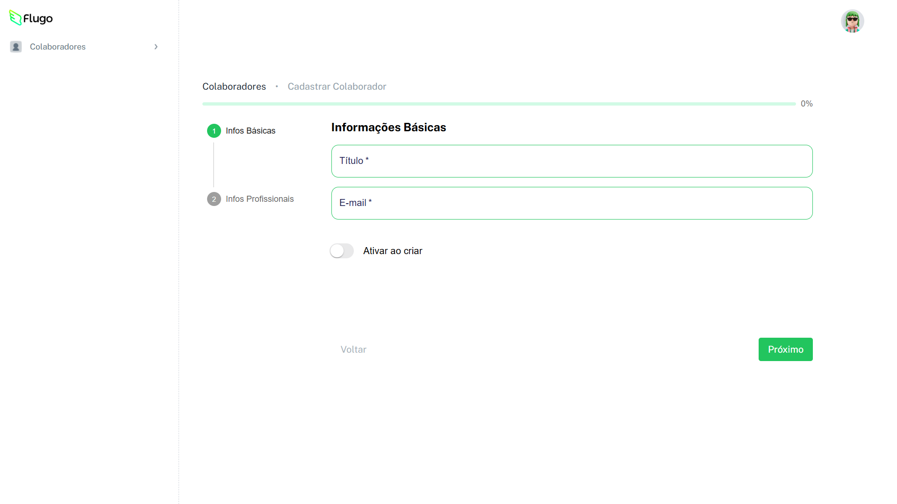

# 🚀 Desafio Flugo - Dashboard React

[](https://react.dev/) 
[](https://www.typescriptlang.org/) 
[](https://mui.com/) 
[](https://firebase.google.com/) 
[](LICENSE)

---

## 💡 Sobre o Projeto

Este projeto foi desenvolvido como parte do **desafio técnico da Flugo**.  
O objetivo foi construir um **dashboard responsivo** com **React, TypeScript, Material UI e Firebase**, incluindo:

- Sidebar responsiva (menu hamburguer no mobile)  
- Navegação entre etapas com **Stepper**  
- Formulários validados com feedback de erro  
- Integração com Firebase para armazenamento/autenticação  

---

## 📸 Demonstração
 

  
  

---

## ⚙️ Funcionalidades

- 📱 **Layout Responsivo** (sidebar lateral + menu hamburguer no mobile)  
- 🧭 **Stepper** para controle de progresso  
- 📝 **Validação de formulários** (campos obrigatórios e email válido)  
- 🔘 Componentes customizados: Botões, Switches, Progress Bar  
- 🔥 **Integração com Firebase** (Auth, Firestore, Storage)  
- 🌐 Navegação entre páginas com **React Router**  

---

## 🚀 Como Rodar o Projeto

### 1. Clone o repositório
```bash
git clone https://github.com/seu-usuario/nome-do-projeto.git
cd nome-do-projeto
```

### 2. Instale as dependências
```bash
npm install
```
### 3. Configure o Firebase
Crie um projeto no Firebase Console e adicione suas credenciais no arquivo src/server/firebase.ts:
```bash
export const firebaseConfig = {
  apiKey: "SUA_API_KEY",
  authDomain: "SEU_AUTH_DOMAIN",
  projectId: "SEU_PROJECT_ID",
  storageBucket: "SEU_STORAGE_BUCKET",
  messagingSenderId: "SEU_MESSAGING_SENDER_ID",
  appId: "SEU_APP_ID",
};
```

### 4. Inicie o servidor de desenvolvimento
```bash
npm run dev
```
---
## 🌐 Demo Online

O projeto está hospedado no Vercel e você pode testar a aplicação diretamente no navegador:

[🔗 Teste o projeto aqui](https://desafioflugo.vercel.app/)

> ⚡ Nota: Esta é a versão de teste do desafio Flugo. Alguns recursos podem depender de dados em tempo real do Firebase.

---

### Sobre a Vercel

[Vercel](https://vercel.com/) é uma plataforma de **deploy e hospedagem de aplicações web**, otimizada para projetos front-end como **React**, **Next.js**, **Vue** e outras frameworks modernas.  

Principais vantagens da Vercel:  
- Deploy rápido e fácil diretamente do **GitHub**, **GitLab** ou **Bitbucket**  
- Criação automática de **preview deployments** para cada pull request  
- CDN global integrada para **carregamento rápido** de páginas  
- Suporte a **Serverless Functions** para back-end leve  
- Fácil integração com **variáveis de ambiente** e APIs externas  
### 🔧 Tecnologias Utilizadas

- **React** – Biblioteca para construção de interfaces

- **TypeScript** – Superset do JavaScript com tipagem estática

- **Material UI (MUI)** – Framework de componentes UI

- **Firebase** – Backend-as-a-Service (Auth, Firestore, Storage)

- **React Router** – Navegação entre páginas
  
---
👤 Autor

Desenvolvido por **Bruno Veloso** ✨</br>
🔗 [LinkedIn](https://www.linkedin.com/in/brunovelosoo/)</br>
 💻 [GitHub](https://github.com/brunovelosodossantos26)
